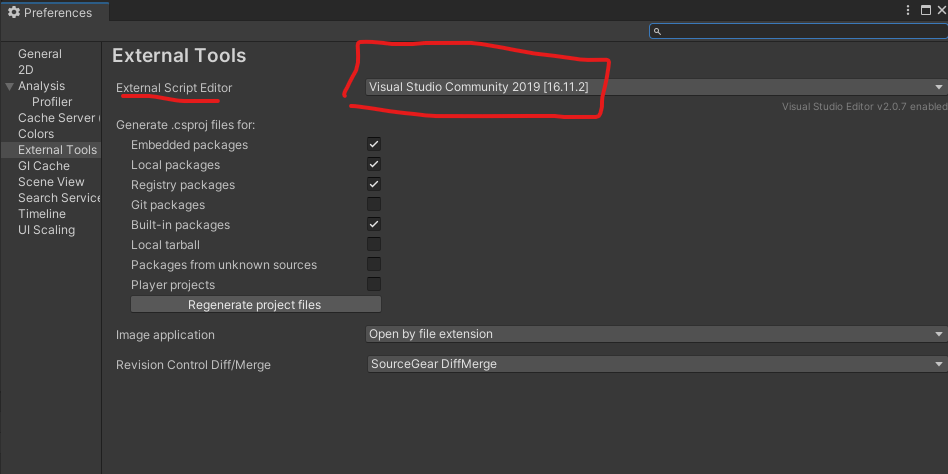

# C# Scripting
> It's basically Java minus the Java

Assuming you have Visual Studio (or Visual Studio Code) on you machine, we can go right into creating our own components, or Scripts. And yes, the scripts that you write function exactly the same way that Unity’s components do. 

To create a script, we can right click in the project window and select Create -> C# Script


**Careful:** If you click after doing this, the script will be made incorrectly. You will notice the script is highlighted, start typing the name of the script (let's call it PlayerMovement.cs), and then press enter. If you don't do this script (and class) will be created with a default name. You can right-click and delete it if this happens to you.


Note that you can also create scripts by clicking the add component button typing the name, selecting new Script, then Create and Add. 
This is safer than the other way, But has the downside that it is created in the Default assets folder. Right now we don’t have any other folders, but we’ll create a dedicated scripts folder later which you would then have to move the script to. Plus, you may not want to add it to a gameObject right
away, you might want to add it at runtime through code.
Each method has its upsides and downsides, just keep in mind 
that both are available to you.


Double click it to open it up and you should get something like this


### Fix Visual Studio Not Being Connected to Unity

Select Edit -> Preferences -> External Tools and make sure the external script editor is set to your version of Visual Studio or VSCode. 



Ok, let's start at the top:


The first 2 lines are grayed out to indicate we are not using them. Unity includes them by default since they are commonly used.


These first 3 lines are your using tags. They function similar to the way the import statements in Python and Java, and the include statements in C work. It allows you to use types that are defined either by the system in premade namespaces, or by you in your own user defined namespaces
A namespace is just a collection of code/files that can be included in your script. Similar to libraries in Python/C and packages in Java.

```c#
public class PlayerMovement : MonoBehavior 
{
```

The next line is the class definition. If you don't know what a class is, it is essentially a container for 2 things, data (i.e. variables) and functions.

Everything between the "{" on line 6 and the corresponding "}" on line 18 is part of the PlayerMovement class. You'll notice this class is the same name as your file. Unity does this when creating the file, which is why you can't click while creating the script. Otherwise, the class name will be the default name NewBehaviorScript, which you will have to change manually (both the class name and the file name since Unity needs them to match)

The next part of this class declaration. The `: MonoBehavior` the base class of our script. Essentially, somewhere in the UnityEngine namespace there is a class called `Monobehaviour`. And that is a very special class that most of your scripts are going to want to **inherit** from. 

### A Brief Explanation of Inheritance

One of the cool things about classes is that it allows for a special type of code reuse called inheritance. You can write code in one class, the *base* or *parent* class, and then *derive* or *inherit* from that base class in another class, called the *derived* or *child* class. The derived class can now access the code from the base class.

Imagine we are making a player weapon class for this game. Each weapon has stats about how much damage it does, the range, attack speed, etc, and a function that makes it do damage. But the overall functionality is the same, to do damage. 
A good way to implement this would be with a base class, let’s call it weapon, that your derived classes, let’s say sword and spear, can inherit from.  Sword and spear don’t need to define the DoDamage() function since it’s defined in the weapon class and the functionality is the same.
But when a sword calls the DoDamage() function, it applies it’s stats to the attack. 
Additionally, there could be different types of swords as well, and those could derive from the new Base sword class. 
There is a lot more to inheritance, which you will start to cover in CS140 but this should hopefully give you enough to understand the basics of C#. If not feel free to ask organizers for additional explanation. 

Now onto the functions. Functions in C# are written like in C or Java. 

```ReturnType FunctionName(paramater1, parameter2, etc){}```

For Python users, note you must specify the return type of the function. In this case, `void` indicates the function does not return a value.

Monobehaviour comes with
many functions that you can 
inherit, but the two below
are the most common. 
The comments (they start with
`//` in C#) give a pretty good
explanation of what they do, 
but let’s do a demonstration

```c#
// Start is called before the first frame update
void Start() 
{

}

// Update is called once per frame
void Update()
{

}
```

In the Start function, let’s write a print statement.

C# writes print lines like this `Console.WriteLine();` (Python peoplpe note the semicolon at the end of the line). 
But that won’t help us here since you can’t use it in Unity.
Instead, Unity has its own version like this: `Debug.Log("Start");`.


You can also use LogWarning and LogError for more noticeable messages 
As a shorthand, Unity also provides a `print()` function which is the same as `Debug.log()`. It’s part of `monoBehaviour`, so as long as your class inherits from that (which almost all of them will) it should work

Let's also add a print statement in the Update function that prints the word update.


Now, in order to run this script we need it to be on a GameObject. The other key thing that MonoBehaviour does is it lets us attach the script to a GameObject. So only scripts that inherit from MonoBehaviour can be put on GameObjects.

Let’s put it on the sphere we made earlier.

To attach the script, we can simply drag it from the project window to the add component button on a gameObject. 

You can also click the Add Component button and start typing it like before.

If you press play and make sure you have the Console window showing, you should see this. One call to start, followed by an ever increasing number of calls to update.


And that should give you a pretty good idea of what they each do. 

Start is called once, and only once, at the start of the game, or when an object is created. If you add a bullet to the game when a gun is fired, the bullet’s start function is called then. Start is used for initialization and for things that only need to happen once.

Update is called every single frame. So the more frames per second you have, the more times per second update gets called. Update is used for things that need to continuously be done, like applying forces and checking for input.

Let’s go over some basic code syntax

If you are used to python, C# has a lot more `;` and `{ }`.

Variable declaration:

```c#
    int i = 10; // integer (32 bit)
    long l = 10; // integer (64 bit)
    char c = 'c'; // single character
    float f = 2.1f; // floating point value (32 bit)
    double d = 2.1; // floating point value (64 bit)
    string s = "string"; // string of multiple chracters

    int[] arr = new int[10]; // fixed size array of contiguous memory
    List<int> list = new List<int>(); // variable size list of a single type (java Arraylist, c++ vector)
    ArrayList alst = new ArrayList(); // variable size list of any type (python list)
``` 

### If Statement

```c#
if (condition) {
    // action
} else if (otherCondition) {
    // other action
} else {
    // final action
}
```

### For Loop
```c#
for (int i = 0; i < 10; i++) {
    print(i);
}
```

### Foreach Loop (enchanced for loop)

```c#
int[] arr = new int[10];
foreach(int i in arr) {
    print(i);
}
```

### While Loop
```c#
while (boolean) {
    // something
}
```

## Naming Conventions

I'm going to leave you with some naming conventions. You can, of course, ignore them if you don't like them. Just sometthing to be aware of.

Functions are written in Pascal case:
```c#
private void MyFunction() {

}
```

Variables are written in camelCase:
`int myInt = 0;`

I don't even do this one all the time, but it can be a good diea to make instance variables start with an underscore. These are the variables in your class and it helps to differentiate them from local variables. 